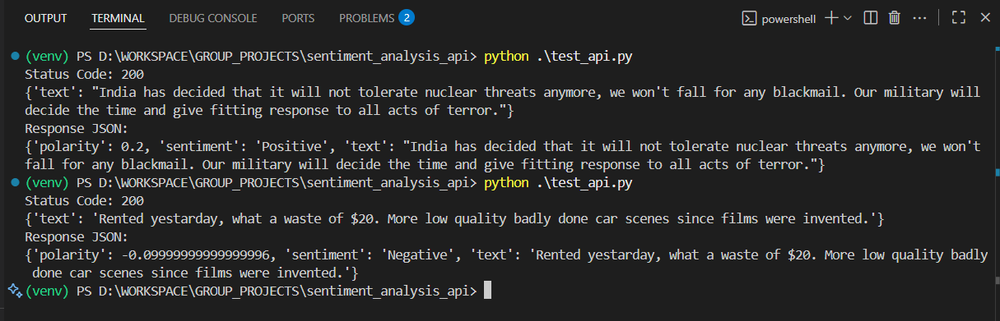
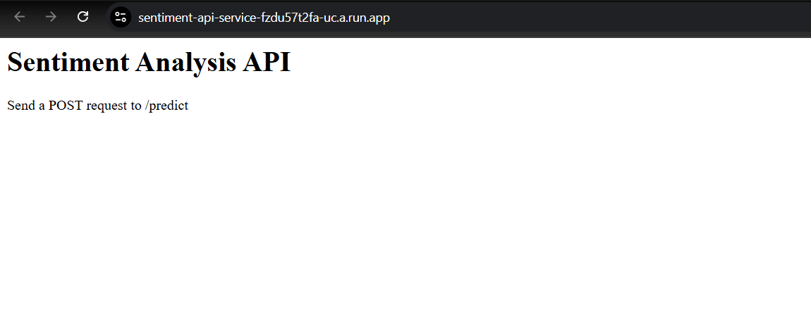

# Sentiment Analysis API

A lightweight Flask-based API that provides instant sentiment analysis for text inputs. Using TextBlob's natural language processing capabilities, this service classifies text sentiment as positive, negative, or neutral, along with a polarity score indicating the strength of the sentiment.

Built with Python and containerized using Docker, this API is designed for simple deployment and scaling. The service uses Gunicorn as the WSGI HTTP server, making it production-ready and suitable for cloud platform deployment.

The API exposes two endpoints: a root endpoint (/) that confirms the service is running, and a prediction endpoint (/predict) that accepts POST requests with JSON payloads containing the text to analyze. It returns a structured response with the analyzed text, sentiment classification, and polarity score.

## Live API

The API is currently hosted at:
https://sentiment-api-service-fzdu57t2fa-uc.a.run.app/

Try it out with:
```bash
curl -X POST https://sentiment-api-service-fzdu57t2fa-uc.a.run.app/predict \
    -H "Content-Type: application/json" \
    -d '{"text": "Your text here"}'
```

## API Overview





## Quick Start

```bash
# Clone and run with Docker
git clone https://github.com/OMCHOKSI108/gcp-sentiment-analysis-api.git
docker build -t sentiment-api .
docker run -p 8080:8080 sentiment-api
```

## API Usage
```bash
curl -X POST http://localhost:8080/predict \
     -H "Content-Type: application/json" \
     -d '{"text": "This is amazing!"}'
```

## Dependencies
- Python 3.9
- Flask 2.2.3
- TextBlob 0.17.1
- Gunicorn 20.1.0

## Contact
- GitHub: [@OMCHOKSI108](https://github.com/OMCHOKSI108)
